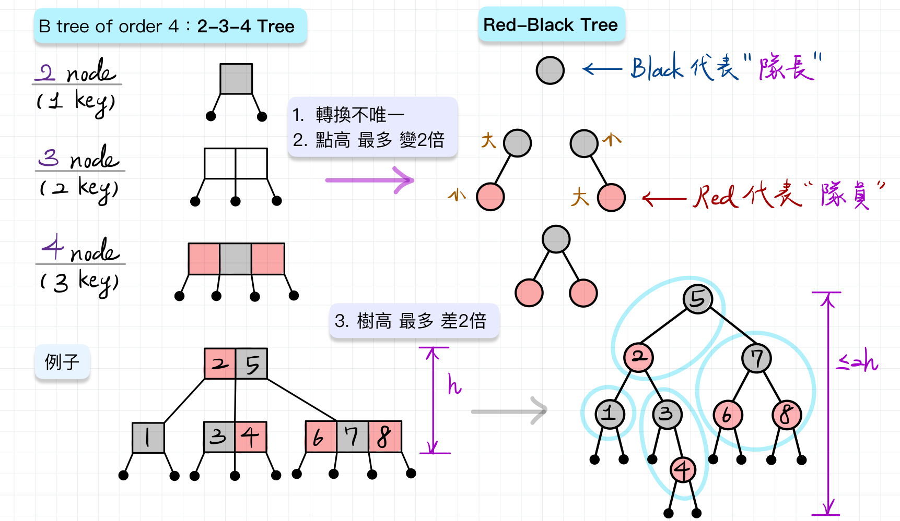

# DataStructure Implementation

This repository contains all the data structure implementations I learned in my DS class and the class assignments. I made every effort to implement every single structure by myself.

----

## Content
[Folder] 02-Array

[Folder] 03-Stack
- Stack、Queue、Infix_to_Postfix、Postfix_Evaluation_stack

[Folder] 04-Linked List
- Single Linked List、Double Linked List、General Linked List
- Equivalence_Classe、Sparse_Matrix

[Folder] 05-BasicTree
- BinaryTree、SAT Problem、ThreadBT、Heap、BST

[Folder] 06-Graph
- Traversal(DFS、BFS)、MST(Kruskal、Prim)、Shortest_Dijkstra

[Folder] 07-Sorting
- Searching(Linear/Binary)
- Basic Sort
    1.  void insertionSort(T *a,int n)
    2.  void selectionSort(T *a,int n)
    3.  void bubbleSort(T *a,int n)
- Advance Sort
    1. void aQuickSort(T *a,int m,int n)
       & int partition(T *a,int m,int n)

    2. int rMergeSort(T *a, int left,int right)
       & int listMerge(T *a, int p,int q, int n)

    3. void heapSort(T *tree,int n)
        a.  void adjust(T *tree, int rIdx, int n)

- Linear-time Sort
    1.  void radixSort(T *a,int r,int n)
    2.  void countingSort(T *a, int r, int exp, int n)
    3.  void cRadixSort(T *a, int r, int n)
    4.  void bucketSort(T *a, int r, int n)

[Folder] 08-Hash
- Directory、Directoryless

[Folder] 10-AdvancedTree
- AVL、Red Black Tree

[Folder] 11-Assignment (8)
- 8 assignments from NSYSU 